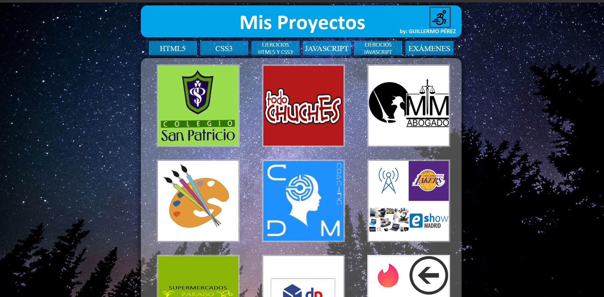

# Supercar

## About The Project

Hace poco, mirando archivos en mi portátil, me encontré con éste proyecto web. Es muy significativo para mí, porque es el primer sitio web que he colgado en internet, y fue el inicio de todo lo que estoy haciendo ahora, y el inicio de muchas cosas grandes que vendrán. Como me gustaba experientar, probar, fallar y aprender, el diseño y las funciones que tiene, aunque son muy básicos y algo feos, para mí era algo fantástico, algo que nunca pensé que podría llegar a hacer. Espero que lo disfrutéis visitándolo, tanto como yo disfruté desarrollándolo, y para las personas que se quieran dedicar a éste mundo, creerme, merece la pena 😊 

------------------------------------------------------------------------------------------------------------------------

While looking through files on my laptop recently, I came across this web project. It's very significant for me, because it's the first website I've put up on the internet, and it was the start of everything I'm doing now, and the start of many great things to come. As I liked to experiment, try, fail and learn, the design and functions that it has, although they are very basic and somewhat ugly, for me it was something fantastic, something that I never thought I could do. I hope you enjoy visiting it, as much as I enjoyed developing it, and for people who want to dedicate themselves to this world, believe me, it's worth it 😊

## Website screenshot

    

 

## Contact

Guillermo Pérez - [LinkedIn](https://linkedin.com/in/guillermo-perez-fuentes)
Portfolio - [The Bulliam](https://thebulliam.com)